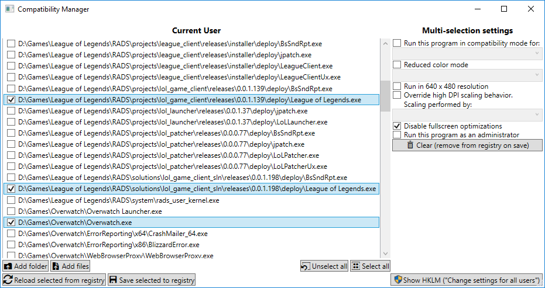

# Compatibility Manager

A Windows app for bulk editing compatibility settings. It allows you to quickly enable/disable compatibility settings for multiple applications at once, instead of having to go through them one by one.

## Installation

1. [Download the latest release.](https://github.com/Skymirrh/CompatibilityManager/releases/latest)
1. Extract it (you'll need [7-Zip](http://www.7-zip.org/)).
1. Run `CompatibilityManager.exe`.
1. ???
1. Profit.

## But why?

Because in Windows 10 Fall Creators Update (1709), there is no possibility to globally "disable fullscreen optimizations"™.

There used to be one in [Anniversary Update (1607)](https://www.reddit.com/r/Windows10/comments/645ukf/windows_10_cu_fullscreen_optimizations/dhounib/?context=1),
which was still working in [Creators Update (1703)](https://www.reddit.com/r/Windows10/comments/645ukf/windows_10_cu_fullscreen_optimizations/dmyx1y9/?context=1),
but now [it ain't working no more](https://www.reddit.com/r/Windows10/comments/78r88x/can_i_disable_full_screen_optimizations_globally/dp95fpy/?context=100).

### But aren't "fullscreen optimizations"™ good?

Maybe! If they're working for you, that's great: you should keep using them.

In my case, they don't seem to work as intended, and introduce stuttering. I have confirmed "fullscreen optimizations"™ to be the cause of these issues because either:
* Switching a game from fullscreen to windowed or borderless (where "fullscreen optimizations"™ can't do no harm) makes the stuttering disappear.
* Disabling "fullscreen optimizations"™ makes the stuttering go away.

So, I'd just like to be able to disable them once and for all, Microsoft please pretty please :((

#### Why not just use borderless/windowed mode instead?

I care about optimal performance, and am a smoothness freak.

Theoretically, games should run smoother in fullscreen than in borderless/windowed mode because the GPU has exclusive control, instead of having to deal with Windows' DWM (Desktop Window Manager) to draw applications in the screen space.

Unless, of course, when Windows tries to interfere... ¯\\\_(ツ)_/¯

#### Why isn't it called "Fullscreen Optimizations"™ Manager then?

Because it does a bit more than that. Please don't assume Compatibility Manager's intended behaviour, that triggers me.

## What are all these compatibility settings for anyway?

The app mirrors exactly what you'd find in the Compatibility tab of an application's properties.

A good place to start would be the [official Windows documentation](https://support.microsoft.com/en-us/help/15078/windows-make-older-programs-compatible).
As for fullscreen optimizations, you can find more info about their purpose [here](https://www.reddit.com/r/Windows10/comments/645ukf/windows_10_cu_fullscreen_optimizations/), though it should be noted that, as seen in the links above, their behavior probably have changed along with Windows Updates.
